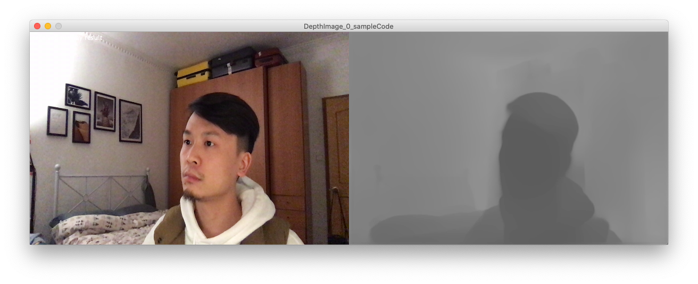

# fakeKinect
This is a ~~javascript~~ Processing library provides Microsoft Kinect alike functionalities with a regular webcam. This library requires ~~tensorflow.js~~ Runway as depandency.  

Example screenshots:

